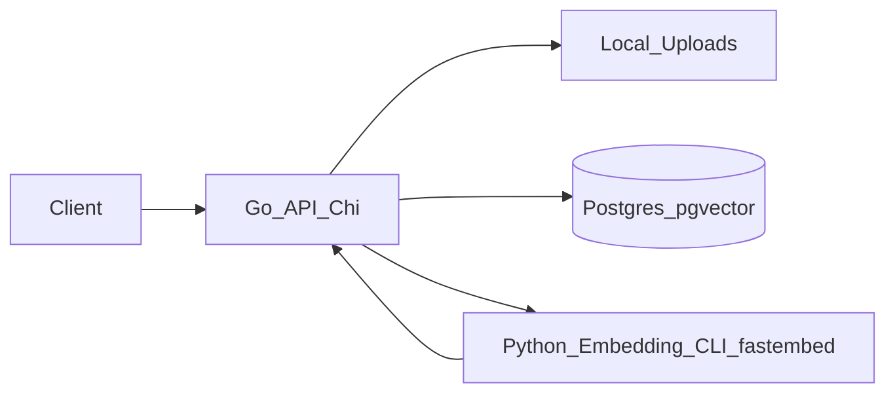

# AI Document Assistant

Secure backend for uploading documents (TXT/PDF) and running **semantic search** over your private library using **pgvector**. It provides JWT-authenticated APIs for document management plus vector search/query endpoints.

## What this repo contains
- **Go API** (Chi + GORM): auth, document upload, parsing, background processing, search/query.
- **Python embedding CLI** (`fastembed`): chunks text and produces embeddings that are stored in Postgres/pgvector.
- **Postgres + pgvector**: stores document metadata and chunk embeddings; supports similarity search via `<=>`.

## Architecture



**Flow (upload → searchable):**
- `POST /api/documents` uploads a file and triggers async processing.
- Backend extracts plain text (TXT/PDF), chunks it, calls the Python CLI to embed chunks, then stores vectors in `document_chunks`.
- `POST /api/search` and `POST /api/query` embed the query and run pgvector similarity search.

## Tech stack
- **Backend**: Go (Chi, GORM)
- **Embeddings**: Python (`fastembed`, model `BAAI/bge-small-en-v1.5`)
- **Database**: Postgres + pgvector (`ankane/pgvector`)
- **Containerization**: Docker + Docker Compose

## Prerequisites
Choose one of the following setups:

- **Docker-first (recommended)**:
  - Docker Desktop (or Docker Engine + Compose v2)
- **Local dev (no containers)**:
  - Go 1.25+
  - Python 3.12+
  - Postgres with `vector` extension (or run DB via Docker only)

## Quick start (Docker Compose)
From the repo root (where `docker-compose.yml` lives):

```bash
docker compose up -d --build
docker compose ps
```

API will be available at:
- `http://localhost:8080`
- Health check: `http://localhost:8080/health`

### Stop / reset
```bash
docker compose down
```

Remove volumes too (DB data + uploads + model cache):
```bash
docker compose down -v
```

## Local development (run Go directly)
This is useful if you want hot iteration in Go while keeping Postgres in Docker.

### 1) Start Postgres (pgvector)
```bash
docker compose up -d db
```

### 2) Configure environment
Backend loads `.env` (optional) from `backend/.env`.

Recommended minimal values:
- `DB_HOST=localhost`
- `DB_PORT=5432`
- `DB_USER=postgres`
- `DB_PASSWORD=postgres`
- `DB_NAME=aidocdb`
- `JWT_SECRET=<some-long-random-string>`

Embedding CLI configuration:
- `PYTHON_PATH=python3` (default)
- `SCRIPT_PATH=/absolute/or/relative/path/to/embedding-service/app/main.py`

> Note: `EMBEDDING_SERVICE_URL` is **not used** in the current implementation (embeddings are generated via CLI execution, not HTTP).

### 3) Run the Go API
```bash
cd backend
go mod tidy
go run cmd/api/main.go
```

## API usage (curl)

### 1) Health
```bash
curl -s http://localhost:8080/health
```

### 2) Register + login (JWT)
```bash
curl -s -X POST http://localhost:8080/api/register \
  -H "Content-Type: application/json" \
  -d '{"username":"rohan","email":"rohan@example.com","password":"Pass@123"}'

curl -s -X POST http://localhost:8080/api/login \
  -H "Content-Type: application/json" \
  -d '{"email":"rohan@example.com","password":"Pass@123"}'
```

If you have `jq` installed:
```bash
TOKEN=$(curl -s -X POST http://localhost:8080/api/login \
  -H "Content-Type: application/json" \
  -d '{"email":"rohan@example.com","password":"Pass@123"}' | jq -r '.token')
```

### 3) Upload a document
```bash
echo "Company policy: Employees can work remotely 2 days per week." > sample.txt

curl -s -X POST http://localhost:8080/api/documents \
  -H "Authorization: Bearer $TOKEN" \
  -F "document=@sample.txt"
```

### 4) Search / query
```bash
curl -s -X POST http://localhost:8080/api/search \
  -H "Authorization: Bearer $TOKEN" \
  -H "Content-Type: application/json" \
  -d '{"query":"remote work policy"}'

curl -s -X POST http://localhost:8080/api/query \
  -H "Authorization: Bearer $TOKEN" \
  -H "Content-Type: application/json" \
  -d '{"query":"How many remote days are allowed?"}'
```

## Configuration reference

### Backend env vars (common)
- **`PORT`**: API port (default `8080`)
- **`DB_HOST` / `DB_PORT` / `DB_USER` / `DB_PASSWORD` / `DB_NAME`**: Postgres connection
- **`JWT_SECRET`**: secret used to sign JWTs (**change for production**)

### Embedding CLI env vars
- **`PYTHON_PATH`**: python interpreter used by the Go backend (default `python3`)
- **`SCRIPT_PATH`**: path to embedding CLI script (default in container: `/app/embedding-service/app/main.py`)

## Repository structure
- `backend/`: Go API service
  - `cmd/api/main.go`: entrypoint & route wiring
  - `internal/`: handlers, middleware, services, repositories, models
  - `pkg/`: utilities, database, parsing/extraction
- `embedding-service/`: Python embedding CLI code and requirements
- `docker-compose.yml`: local stack (Postgres + backend)
- `Dockerfile`: production-style multi-stage build for backend (Go + Python runtime)

## Troubleshooting

### “failed to read dockerfile: open Dockerfile: no such file or directory”
Run Docker commands from repo root and use Compose:
```bash
docker compose up -d --build
```

### First embedding call is slow
`fastembed` downloads the model on first use. Compose mounts `model_cache` to persist it across restarts.

### See logs
```bash
docker compose logs -f backend
docker compose logs -f db
```

## OpenAPI
API contract lives in:
- `backend/api/openapi.yaml`

## Security notes
- CORS is currently permissive; lock it down for production.
- Replace default DB creds + set a strong `JWT_SECRET` before any real deployment.